# pertemuan9

## latihan 1
### membuat list sebanyak 5 elemen 
pertama tama, masukan nilai angka yang diinginkan 

kalau sudah ketik print(data) 

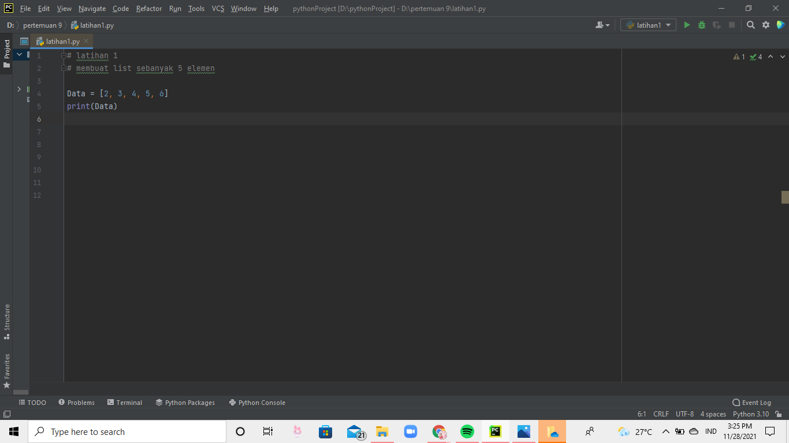
lalu kalau sudah di run, nanti hasilnya akan menjadi seperti ini 

## latihan 2
### akses list 
masukan nilai a lalu print(a ['angka']) 

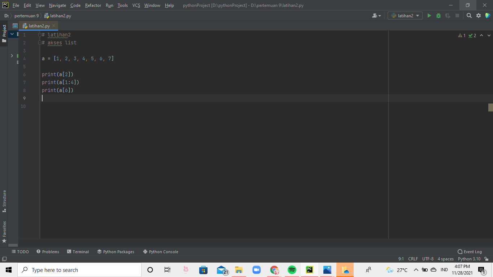
kalau sudah, di run. dan hasilnya akan menjadi seperti ini 

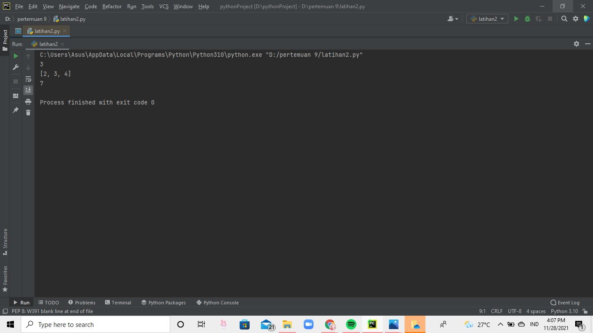

## latihan 3
### mengubah elemen list 
masukan nilai a lalu print angka 'a' nya 

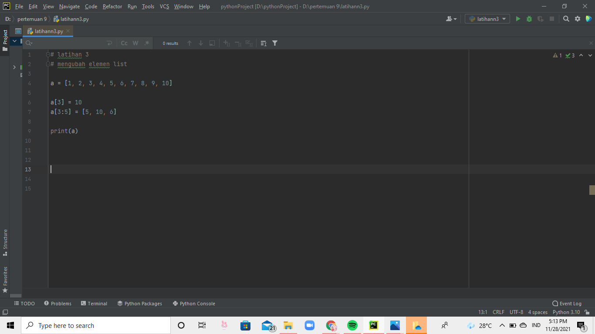
hasil outpunya akan menjadi seperti ini 

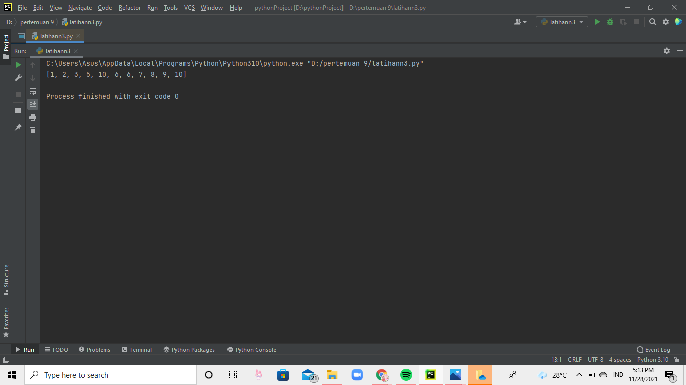

## latihan 4 
### menambah elemen list 
masukkan nilai a dan b, lalu print a dan b 

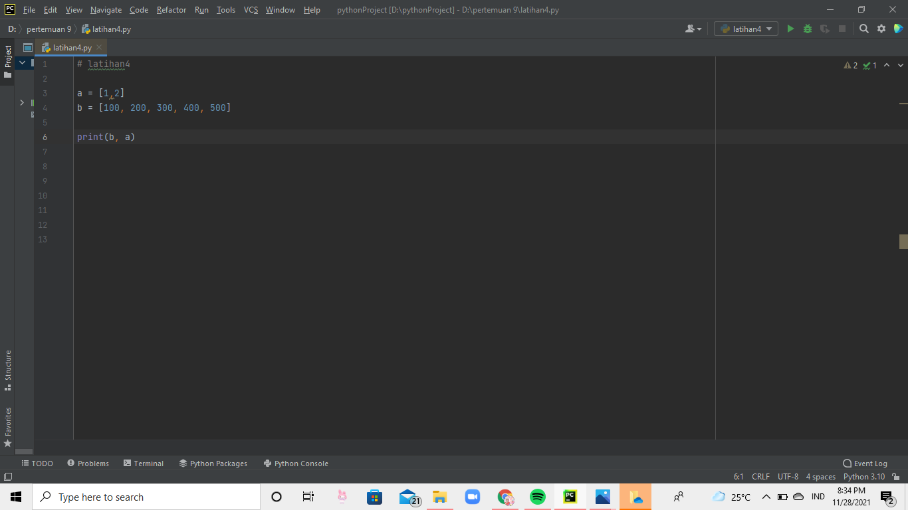
outputnya 

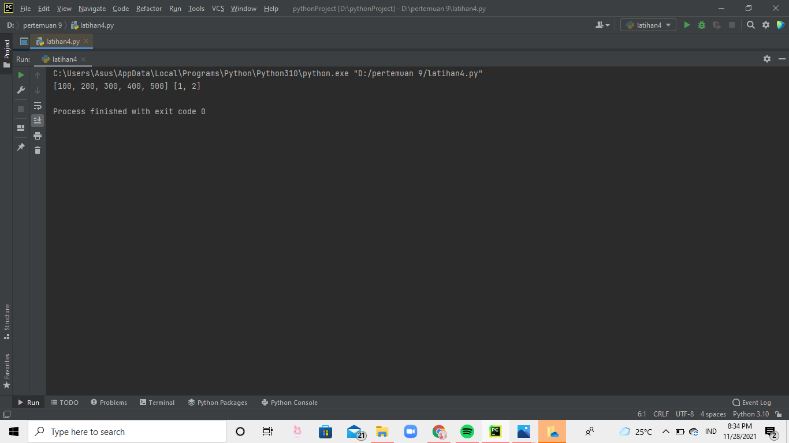
input 

output 

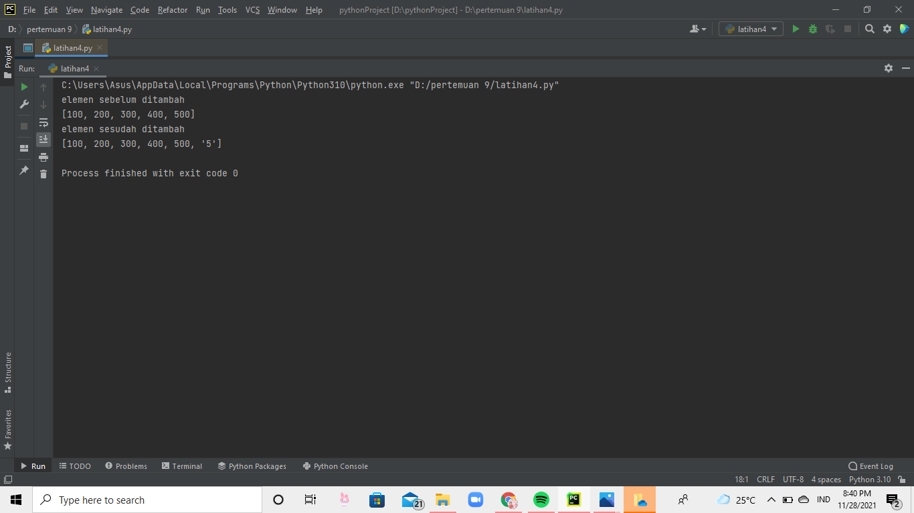
input 

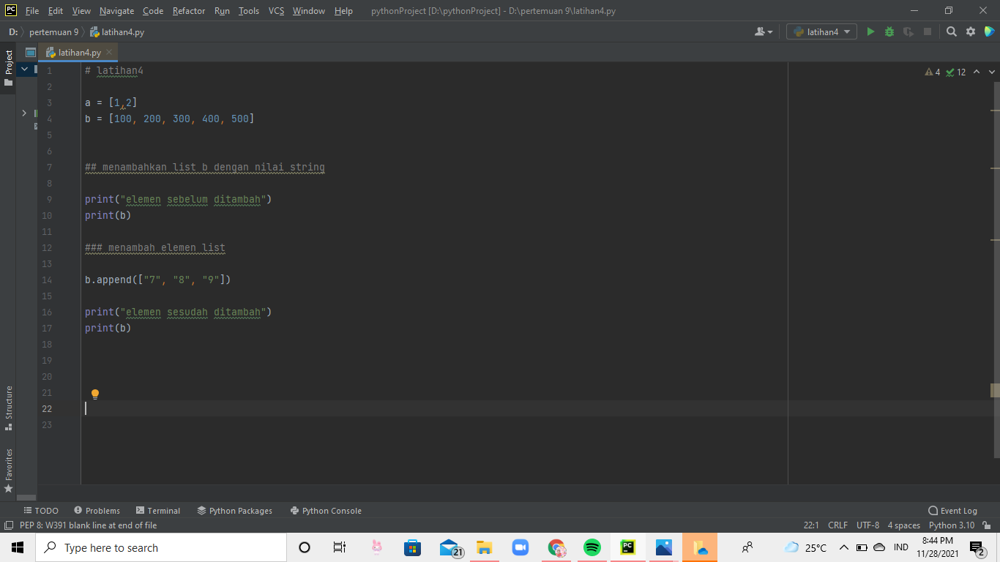
outputnya 

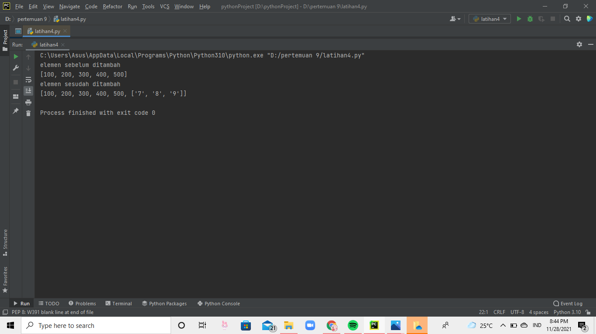
input 

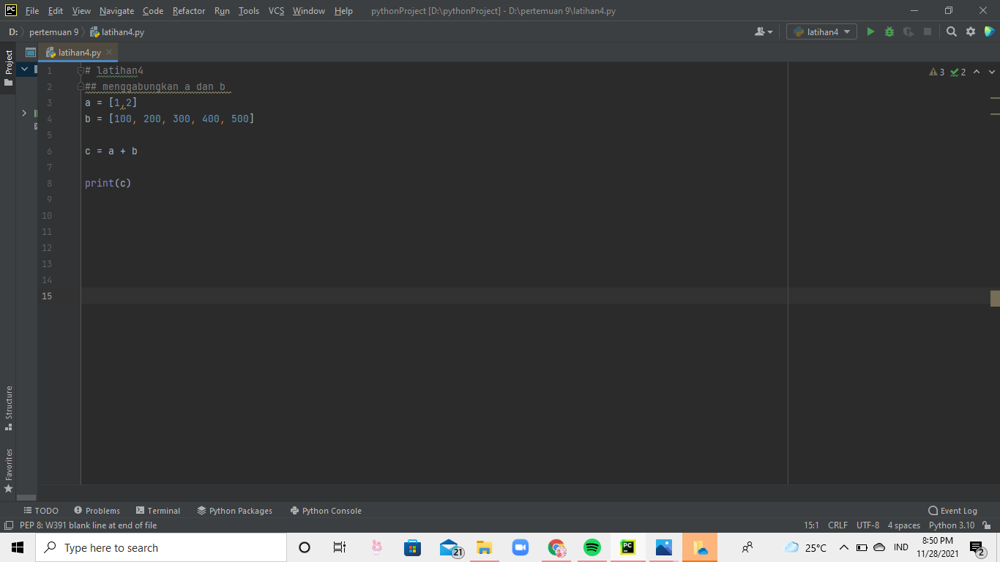
outputnya 

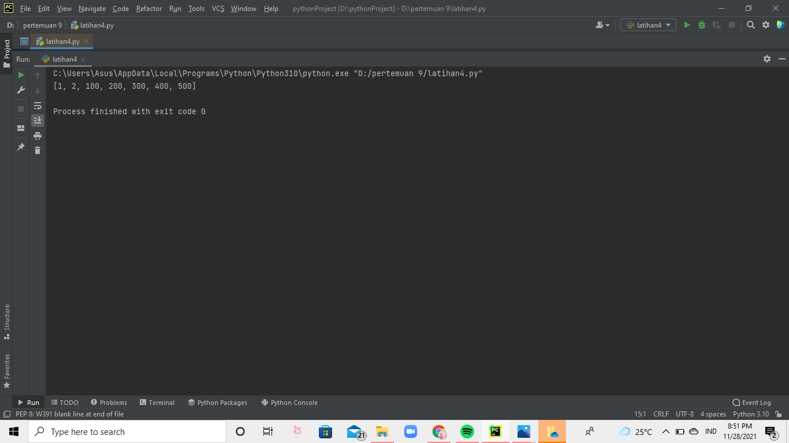

## praktikum 
masukkan listnya, lalu masukan kode for 

lalu diprint + str(i+1)) 

seperti dibawah ini 

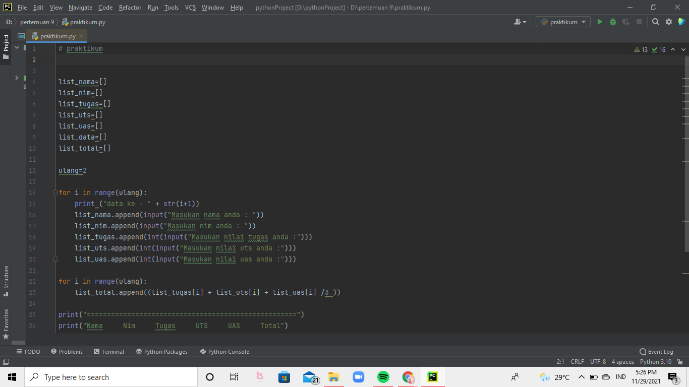
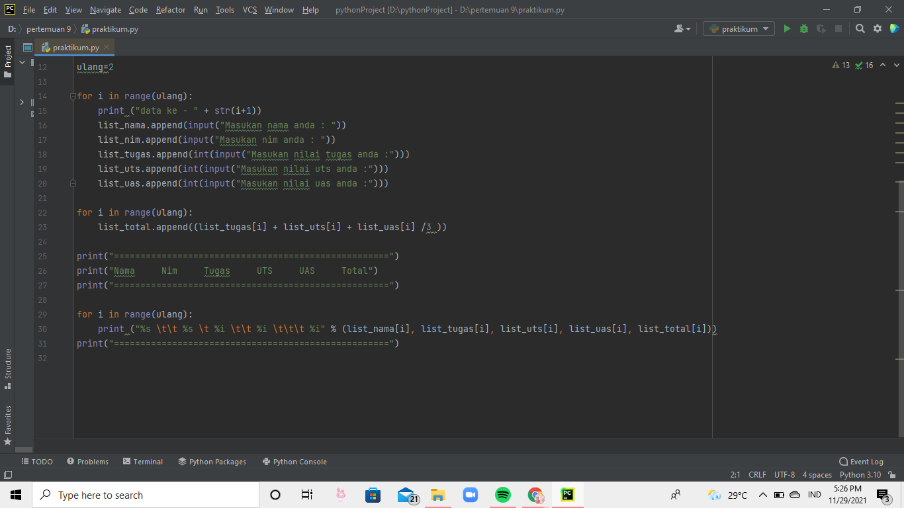
hasil outputnya akan menjadi seperti ini 

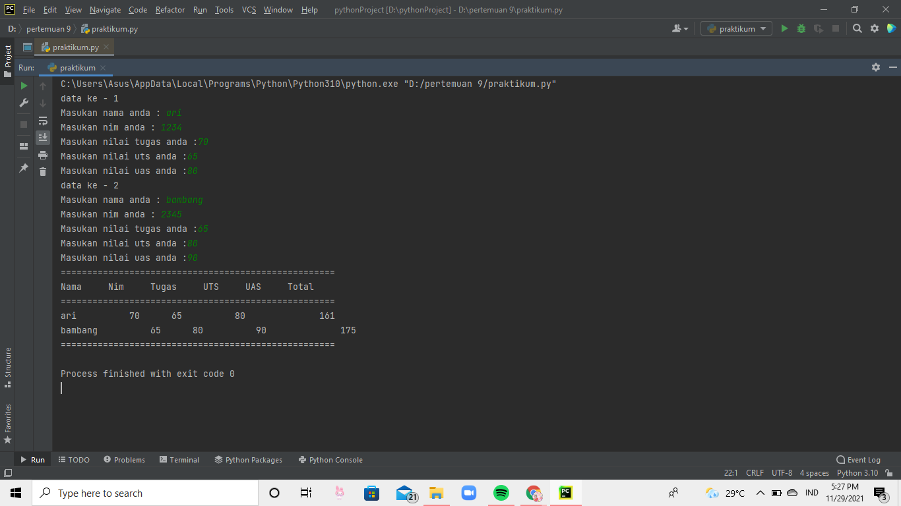
